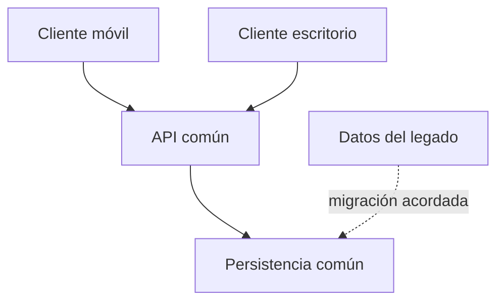

# PI3 · Del contrato al plan ejecutable

Prerrequisito: objetivos y alcance de PI2 localizables; no necesitas dominar las tecnologías de todos los módulos. Resultado: tomar decisiones de planificación comprobables y distinguirlas de una suposición. Esta lectura se distribuye en la ruta; no añade tiempo.

## 1. Qué significa planificar

Un contrato dice qué resultado debe aceptarse. Un plan explica cómo vamos a llegar hasta él bajo restricciones: precedencias, personas disponibles, entorno, permisos y calendario. El **baseline** es la versión de referencia del plan en una fecha. No es una predicción infalible: permite saber qué se acordó, qué supuesto falló y qué cambió después.

PI2 ya justificó objetivos, IN/OUT, viabilidad, financiación y calidad prevista. PI3 toma esas decisiones como entrada. Si descubre una incompatibilidad que cambia alcance, propone un Change Request prospectivo; no edita retrospectivamente el contrato para que coincida con su plan. RA3.g (valoración económica) y RA3.h (documentación de ejecución completa) quedan en PI4, igual que el seguimiento real de RA4. Los documentos aquí son evidencia de planificación RA3.a–f, no una concesión de RA3.h.

Piensa en dos capas: **compromiso** y **preparación**. El primero conserva IDs, AT y aceptación; la segunda añade actividades, dependencias, estimaciones, recursos y decisiones. Varias actividades pueden contribuir a una tarea contractual. Eso no multiplica su valor. Una actividad que cambia la base de datos y otra que prepara su demostración pueden referenciar el mismo ID contratado; ninguna crea nuevos AT.

En AulaFlow 2.0 v1.0 hay 264 tareas de oferta / 572 AT, con 96 obligatorias / 150 AT. Solo `ACEPTADA` valida AT. Los AT no son horas, puntos de esfuerzo ni nota automática. Cambiar una estimación de 4 a 7 horas no cambia los AT congelados. Sin el XLSX auténtico no conocemos las filas: un total no permite reconstruirlas. `PENDIENTE_CATALOGO` es una limitación real, no una tarea de nombre parecido.

## 2. Contrato, fase, hito, actividad y tarea · RA2.c/e

| Concepto | Pregunta que responde | Ejemplo sintético |
|---|---|---|
| Resultado contratado | ¿Qué podrá hacer el usuario y cómo se acepta? | Consultar el inventario compartido |
| Fase | ¿Qué bloque de propósito tiene contenido y ventana? | Preparar una fuente de inventario contrastable |
| Hito | ¿Qué estado observable habilita el siguiente paso? | Dos perfiles consultan los mismos tres kits de prueba |
| Actividad | ¿Qué trabajo es necesario para llegar? | Acordar la información que cruza la frontera cliente/servicio |
| Tarea de ejecución | ¿Qué unidad de trabajo asignable tiene entrada y salida? | Revisar con otra persona un ejemplo de respuesta de inventario |
| Evidencia | ¿Qué permite comprobar la salida? | Referencia a la revisión y a los ejemplos aceptados |

Una fase puede atravesar varias iteraciones. Un sprint es una ventana de trabajo; no es necesariamente una fase. Un hito no dura cinco horas: se alcanza cuando se cumple una condición. «Viernes: backend» mezcla una fecha con un componente y no define un hito. Mejor: «fuente común preparada cuando la muestra acordada es legible por ambos clientes; ventana pendiente de disponibilidad del módulo propietario».

Para derivar actividades, recorre cada resultado del contrato: ¿qué entrada necesita?, ¿qué trabajo produce el resultado?, ¿quién debe revisarlo?, ¿cómo se integrará?, ¿qué evidencia permite aceptación? Añade trabajo de preparación, revisión e integración. No añadas funciones OUT con el pretexto de que parecen interesantes. Si dos actividades producen exactamente la misma salida, decide si una es redundante o si falta distinguir sus responsabilidades.

No hace falta inventariar cada pulsación. Una actividad útil tiene tamaño que permite observar una salida y descubrir pronto un bloqueo. «Hacer toda la app» impide estimar; «abrir el editor» no aporta control. El tamaño se refina cuando hay información suficiente.

## 3. Plazos y dependencias · RA2.c y RA3.a

Una dependencia debe tener **causa**, no solo una flecha. En notación FS (fin a inicio), B no empieza hasta que A termina: integrar no puede empezar sin una interfaz acordada. En SS (inicio a inicio), B puede comenzar al empezar A si se ha publicado una entrada parcial suficiente. SS no garantiza que B pueda terminar antes de tener todos los datos. Usa FS por defecto; si eliges SS, escribe qué entrada parcial permite el solape y qué restricción de salida queda.

Haz primero el grafo lógico, después añade recursos y fechas. Un ciclo A → B → A exige revisar la descomposición o acordar una entrada provisional; no se resuelve poniendo ambas el lunes. Distingue dependencia interna (resultado de otra actividad), externa (capacidad del módulo, permiso, entrega ajena) y de recurso (solo hay un dispositivo o especialista).

Una **ruta crítica didáctica** es una cadena de precedencias cuyo retraso desplaza el hito final si nada más cambia. Ejemplo: preparar muestra 1 día, acordar frontera 2, reserva 3, cancelación 2, integración 2: diez días en secuencia. Una actividad paralela de dos días puede tener margen; no todas las fechas son igualmente rígidas. La ruta puede cambiar al limitar un recurso. Un **cuello de botella** es la capacidad escasa que restringe el flujo, aunque no fuera inicialmente la cadena más larga.

Estima en horas de trabajo y separa duración de calendario: 6 horas de una persona disponible 2 horas al día ocupan al menos tres días. Dos personas no reducen todo a la mitad: hay partes secuenciales y revisión. Declara el supuesto y un intervalo si la incertidumbre es grande. Reserva margen visible para aprendizaje, integración y fallos razonables; no lo ocultes duplicando todas las estimaciones ni lo gastes en más alcance desde el primer día.

En AulaFlow los hitos H0–H5 describen el vertical vigente: legado; contrato/preparación; primer backend con clientes; flujo compartido e integración; calidad/puertas activadas; entrega y defensa. PI3 prepara su plan, no declara alcanzados H2–H5 ni imparte su ejecución. La fecha de FE alrededor del 03/03/2027 es una hipótesis operativa pendiente de confirmación institucional. Los plazos afectados deben quedar condicionales, con fecha de revisión.

## 4. Arquitectura global para preparar integración

La arquitectura es un mapa de responsabilidades y límites. Sirve para identificar quién produce la información que otro necesita y qué evidencia confirmará esa frontera. Trabaja en dos niveles: contexto (personas/sistemas que interactúan) y componentes principales. No confundas un diagrama de pantallas con el sistema completo ni una colección de tecnologías con una decisión arquitectónica.

Para cada componente escribe responsabilidad, entrada, salida, propietario curricular de la capacidad, consumidor y estado. Para cada frontera explica qué información cruza, quién conserva la verdad, qué pasa si falla y qué muestra permitirá comprobarla. No necesitas una especificación OpenAPI completa, esquema ORM, clases ni comandos de despliegue.

Modelo global de referencia para discutir AulaFlow, que se debe contrastar con el contrato concreto:

Equivalente textual: móvil y escritorio consumen una API común; esta gobierna la persistencia. Los datos del legado llegan mediante una migración que debe estar acordada y validada. El esquema no afirma que la migración ya exista ni decide cómo implementarla.

| Frontera | Responsabilidad de planificación | Estado que debe contrastarse |
|---|---|---|
| Móvil ↔ API | Datos de lectura/cambio, identidad y respuestas esperadas | Confirmar contrato funcional y capacidad PMDM/AD |
| Escritorio ↔ API | Misma semántica observable del flujo compartido | Confirmar DI/AD y prueba de integración prevista |
| API ↔ persistencia | Fuente de verdad e integridad, bajo AD | Evidencia de capacidad, sin enseñar SQL/ORM |
| Legado ↔ sistema nuevo | Decisiones PI1 conservar/migrar y muestra de contraste | G0 y estrategia acordada, no migración ficticia |

**CONFIRMADO** exige fuente y evidencia accesible; **ASUMIDO** es una hipótesis útil con riesgo y revisión; **PENDIENTE** todavía no permite decidir. «Usaremos un servidor del centro» no está confirmado por aparecer en un dibujo. Registra alternativas, consecuencia y evento de cierre en una decisión breve: contexto, opción elegida o TBD, motivo, alternativas, efectos y revisión.

Una mala frontera deja a dos componentes escribiendo la misma verdad sin regla de coordinación. Para corregirla no hace falta programar: designa quién valida el cambio, qué recibe el otro, cuál es el caso de conflicto y qué módulo debe aportar la capacidad. La implementación pertenece al módulo técnico correspondiente.

## 5. Backlog preparado y tablero · RA3.a

Un backlog recoge trabajo identificable; una lista priorizada sin precedencias no es un plan. Ordena primero restricciones obligatorias, luego integración temprana del vertical, riesgo y valor contractual, siempre con capacidad disponible. Un corte vertical permite observar un pequeño resultado de extremo a extremo; una fase que termina todos los clientes antes de contrastar la API acumula incertidumbre de integración.

Cada entrada relaciona ID contractual auténtico, actividad, hito, predecesoras, entrada, salida, responsable y estado de preparación. Las claves locales de actividades no sustituyen al ID contractual. `TBD` no es un ID. Sin catálogo, la tabla de tareas reales queda sin filas; registra la necesidad en P11 y practica con TRAIN.

Estados útiles de preparación: `POR_ACLARAR`, `BLOQUEADA_DEPENDENCIA`, `PREPARADA`. No declares ejecución `DONE` porque el plan tenga una columna de ese nombre. Más adelante el procedimiento diferencia implementación, revisión y `ACEPTADA`. Limitar el trabajo abierto (WIP) ayuda a terminar y revisar antes de iniciar todo: una regla didáctica es no abrir otra actividad si la anterior está esperando una revisión que tú puedes resolver. Es una decisión del equipo revisable, no un rito Scrum obligatorio.

El tablero representa el baseline; no debe convertirse en una segunda verdad. Conserva una versión abierta del plan y fecha del exporte. La [guía de Projects](../Alumnado/06_GITHUB_PROJECTS_PI3.md) enseña el traslado manual y la alternativa de tabla Markdown. No necesitas automatizaciones de pago.

## 6. Previsión de recursos y logística · RA2.f / RA3.b

RA2.f mira la previsión general: qué materiales y capacidades humanas requiere el proyecto. RA3.b concreta para cada tarea o bloque qué recurso, dónde, cuándo y cómo se consigue. «Un ordenador» es insuficiente si dos actividades requieren el único dispositivo disponible a la vez. «Persona que pueda revisar la frontera» expresa capacidad; «PERSONA-B el jueves con la muestra acordada» expresa asignación.

Distingue recurso obligatorio y opcional, capacidad técnica y disponibilidad real. Una VM, un dispositivo, una cuenta y una API no se gestionan igual. Para cada uno registra ventana disponible, ubicación/entorno, acceso, necesidad de reserva, dependencia y alternativa. No inventes compras o licencias del centro. Los costes identificados en PI2 son entrada; PI3 no rehace financiación ni presupuesto económico RA3.g.

Antes de una integración, verifica la logística: ¿ambas personas tendrán el mismo ejemplo de datos?, ¿existe el recurso en esa franja?, ¿es accesible desde sus entornos?, ¿quién confirma disponibilidad? Si la respuesta es desconocida, cambia la entrada de la actividad a bloqueada y propone una prueba documental o muestra sintética; esa muestra no acredita la integración real.

## 7. Permisos como precondiciones · RA3.c

Acceso técnico y autorización no son sinónimos. Poder abrir un fichero no significa tener permiso para publicar sus datos. Planifica necesidad → solicitante → autorizador competente → fecha límite → evidencia saneada → alternativa. Para un repositorio: rol necesario y confirmación; para despliegue: autorización de usar ese entorno; para datos: procedencia y uso permitido. Se registra el resultado, nunca la contraseña o el token.

Una autorización pendiente bloquea el trabajo que depende de ella, no necesariamente todo el proyecto. Se puede diseñar con datos sintéticos si se etiqueta la sustitución y se programa la comprobación real posterior. `NO_APLICA` requiere motivo concreto: «no se accede a servicio externo porque la simulación es local»; no equivale a «no lo hemos preguntado».

No crees normas legales ni atribuyas al alumnado decisiones del centro. Si hay duda sobre datos reales, consulta al responsable docente por canal autorizado y conserva referencia mínima de su decisión. La técnica de permisos del dispositivo o de IAM se aprende en su módulo; aquí justificas cuándo hace falta y qué evidencia permite avanzar.

## 8. Procedimientos verificables · RA3.d

Un procedimiento conecta entrada, actor, acción, salida, control y fallo. «Usar GitHub» no describe qué hacer cuando la aceptación falla. Ejemplo de flujo previsto: comprobar alcance/entrada → abrir issue con criterio → preparar rama y cambios → revisión por otra persona → integrar cuando los controles aplicables sean suficientes → enlazar evidencia → decisión de aceptación. El estado del tablero es consecuencia de evidencia, no de una fecha.

Define quién decide preparación, quién revisa y quién acepta. El docente decide la aceptación contractual conforme a criterios; una PR fusionada por el equipo no concede AT. Si el recurso falta, registra bloqueo y propuesta, avisa al responsable previsto y evita empezar trabajo incompatible. No se almacenan secretos en issues o capturas.

Los controles técnicos se invocan cuando hay competencia y puerta activa; PI3 no enseña tests, CI, cloud o seguridad. Un procedimiento puede decir «adjuntar resultado del control acordado por el módulo propietario» y dejar su comando en la documentación técnica de ese módulo.

Tras un cambio, conserva la versión anterior, motivo, afectados, decisión y nueva fecha de vigencia. Si solo cambian horas/orden, revisa el plan prospectivamente; si cambia alcance, usa CR antes de modificar el contrato. Volver a una versión documental es posible, pero registra por qué se recupera y no borres la revisión fallida. El ensayo de replanificación de PI3 prepara este sistema; el seguimiento sostenido de cambios reales será PI4/RA4.

## 9. Personas, capacidad y tiempos · RA3.f

La capacidad es el tiempo realmente disponible para este proyecto, descontando obligaciones ya conocidas. No cuenta dos veces una tarde como trabajo autónomo y taller. Pregunta disponibilidad por ventana, conocimientos, necesidad de apoyo y ausencias previstas; usa códigos estables PERSONA-A…D en producción.

Capacidad comprometible = disponibilidad declarada − margen reservado. Es una decisión de planificación, no fórmula curricular. Ejemplo ficticio: 20 horas disponibles, 4 de reserva → comprometer como máximo 16. Una asignación de 18 tiene déficit de 2; no se corrige cambiando AT. Puedes reducir solape, reasignar a una persona capaz, aplazar una ventana o proponer CR si afecta al compromiso. Declara las consecuencias.

Asignar responsable principal no significa trabajo aislado. Añade apoyo/revisor, integra su tiempo y evita que todo dependa de una persona sin sustitución. Bus factor describe cuántas ausencias paralizan una capacidad; no se mide por commits. El backup necesita conocer la entrada y tener disponibilidad: escribir su nombre no le crea horas.

Para 1 persona, no inventes una segunda revisión interna: prevé contraste docente o equivalente autorizado, con disponibilidad pendiente. Para 2, comprueba reserva y especialización sin reducir automáticamente el núcleo contractual. Para 3 o 4, suma capacidad real y controla coordinación; no multipliques productividad ideal. El tamaño recomendado de 3 no es obligatorio. Revisa capacidad antes de comprometer cada ventana; la ejecución real de esa revisión queda en PI4.

## 10. Riesgo, prevención y contingencia · RA3.e

Un riesgo es futuro e incierto: «si no llega la autorización, no podremos demostrar integración». Una incidencia ya ocurrió. Cuando un riesgo se materializa en un ensayo, se practica la respuesta; el registro real sistemático pertenece a PI4.

Describe causa → acontecimiento → efecto. Razona probabilidad baja/media/alta con evidencia, no porcentajes ficticios. Describe impacto en un hito, dato, persona o aceptación. Prioriza combinando ambos: una pérdida grave de datos merece prevención aunque sea menos probable que un pequeño retraso. Una escala ordinal 1–3 y su producto pueden ordenar una conversación, pero no son probabilidad estadística ni nota.

Prevención reduce probabilidad o impacto antes del evento; contingencia indica qué hacer si ocurre. Los **medios** son tiempo, acceso, persona, recurso o información necesarios. El **disparador** es observable: «dos días antes del hito no hay autorización confirmada», mejor que «si pasa algo». Un responsable observa; otro puede decidir la respuesta. Establece revisión y estado.

Ejemplo: causa, una sola persona entiende la frontera; riesgo, ausencia durante integración; prevención, revisión compartida con muestra explicada; medios, 1 hora de ambos incluida en capacidad; disparador, ausencia confirmada antes de la ventana; contingencia, activar backup y desplazar actividades de menor dependencia; responsable, quien coordina esa ventana. Si el backup tampoco tiene horas, la contingencia no es viable.

Incluye lo pertinente: catálogo pendiente, integración tardía, disponibilidad técnica, permisos, datos, deuda del legado, accesibilidad, entorno, incompatibilidades y calendario. La ausencia conocida del catálogo es un bloqueo actual; el riesgo asociado es que persista al inicio de planificación nominal. En prevención de trabajo con equipos, evita pruebas sobre datos reales sin autorización y prevé entorno sintético, pausas/ergonomía y condiciones del centro cuando afecten a una actividad. No hagas una matriz genérica de PRL sin relación con el plan ni un curso técnico de seguridad.

## 11. Dependencias intermodulares y puertas

El mapa curricular informa capacidades previstas, no prueba que tu equipo las domine. AD prepara backend/API/persistencia y migración; DI el cliente de escritorio; PMDM el móvil. PSP, SGE, digitalización, sostenibilidad y cloud aportan capacidades cuando correspondan al alcance y estén disponibles. La coordinación informa dependencias; no exige que otro docente autorice el proyecto PI ni le impone una tarea nueva.

| Capacidad PMDM prevista | Referencia temporal | Qué comprobar antes de depender de ella |
|---|---|---|
| UI/arquitectura móvil PM3 | alrededor de 20/10/2026 | Evidencia personal/cliente utilizable |
| REST/auth/persistencia PM4 | alrededor de 10/11/2026 | Contraste con API común y entorno autorizado |
| Dispositivo/permisos/multimedia PM5 | ventana 17/11–01/12; disponibilidad prevista 01/12 | Evidencia específica; empezar el 17/11 no significa dominarla |
| Calidad/CI PM6 | referencia 12/01/2027 | Controles y recuperación disponibles |
| SDD/agentes PM7 | referencia 26/01/2027 | Competencia real y condiciones de autenticidad |

Una puerta tiene condición observable, evidencia, dependencia, decisión docente y recuperación. Separa **activación** de **cumplimiento**. Estados de activación/preparación: `NO_ACTIVADA`, `PREPARADA`, `ACTIVA`, `BLOQUEADA_DEPENDENCIA`; `RECUPERADA` describe resolución posterior con evidencia, no un permiso automático. G2 integración, G3 calidad/CI, G4 despliegue reproducible y G5 configuración/secretos se activan expresamente cuando existe competencia, criterio, oportunidad y recuperación. No se activan porque llegue noviembre.

G0/G1/G6/G7 están previstas desde el inicio, lo cual tampoco significa superadas. G1 entra `EN_PROGRESO`. P12 recoge contrato, backlog, plan, proceso, capacidad, riesgos y checkpoint individual. El docente decide por persona/equipo. Sin catálogo/contrato real o sin evidencia personal necesaria, queda pendiente; terminar esta UD editorial no cambia esa situación.

## 12. Replanificar con honestidad

Cuando aparece una restricción, conserva el baseline anterior. Localiza primero la causa y el hito afectado; recorre dependencias, recursos, personas y riesgos; compara alternativas; registra decisión y nuevo supuesto. Comprueba lo que se conserva: IDs/AT congelados, criterios y alcance mientras no exista CR aprobado. Publica la nueva versión con fecha de vigencia, no sustituyas silenciosamente la anterior.

Un TBD útil tiene objeto, causa de incertidumbre, responsable, fecha de revisión y evento de cierre. «Servidor TBD» es débil; «entorno de integración pendiente de confirmación docente; revisar antes de H2; se cierra con acceso autorizado y muestra accesible; alternativa ensayo local, sin acreditar H2» permite actuar.

Conserva evidencia individual que conecte decisión y efecto: antes/después, explicación de una precedencia, balance de capacidad, permiso o trigger corregido. El I3 comprueba esa comprensión sin agente. Un plan generado puede ser un borrador; si no puedes localizar y corregir una contradicción, todavía no es tu evidencia suficiente.

---

[Índice de PI3](../README.md) · [Inicio del módulo](../../README.md)
